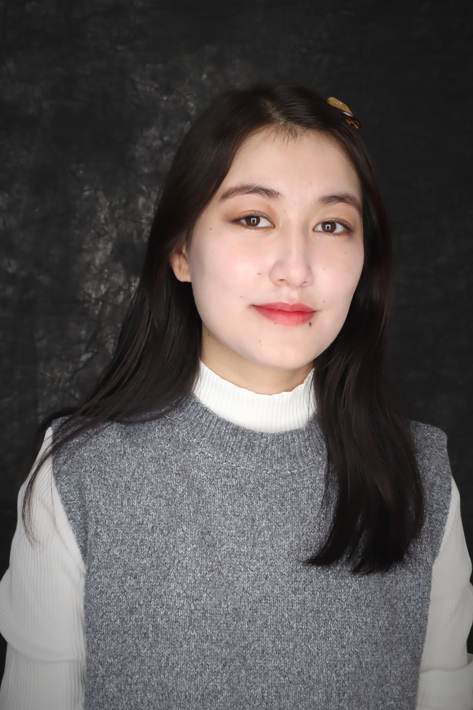

# About

<a href="/" style="margin: 0 14px; font-weight: 600;">About</a>
<a href="/experience" style="margin: 0 14px; font-weight: 600;">Experience</a>
<a href="/projects" style="margin: 0 14px; font-weight: 600;">Projects</a>
<a href="/certificates" style="margin: 0 14px; font-weight: 600;">Certificates</a>
<a href="/contact" style="margin: 0 14px; font-weight: 600;">Contact</a>

---

  <!-- Text -->
  

 

Hi! I’m **Hamida**, a Data Science major with a minor in Health Administration, with strong interests in applying data, technology, and innovation to solve real-world problems—especially in healthcare, research, and social impact.

Through my academic coursework and professional experiences, I have developed a strong foundation in machine learning, statistical modeling, and data analytics. As a Research Intern in a computational biology lab, I worked with real clinical and biological datasets, applied supervised learning techniques, and built predictive models to support cancer research and treatment analysis. This experience strengthened both my technical skills and my ability to work in research-driven, interdisciplinary environments.

In addition to my technical background, I bring strong leadership and communication skills from my roles as an Orientation Leader, Peer Instructor, and Office Assistant at Rutgers University. These experiences have allowed me to support diverse student communities, manage complex responsibilities, and collaborate effectively in fast-paced environments. As a Persian (Dari) Translator and Interpreter, I have also developed cultural awareness and the ability to communicate complex information clearly and empathetically.

I am currently completing a certificate in **Entrepreneurship**, which has strengthened my interest in innovation, product development, and turning data-driven ideas into impactful solutions. This has encouraged me to think beyond technical implementation and consider business strategy, user needs, and long-term sustainability when developing projects.

I am passionate about continuous learning and enjoy combining data science, healthcare knowledge, and entrepreneurial thinking to create meaningful, scalable solutions. I am actively seeking opportunities in data science, analytics, and AI-driven research where I can contribute, grow, and make a positive impact.

  <!-- Image -->
  

    

  

**Focus Areas**
- Machine Learning & Statistical Modeling  
- Data Analytics & Visualization  
- Healthcare & Computational Research  
- AI Tools & Agentic Systems  
- Data-Driven Product Development  
- Entrepreneurship & Innovation Strategy
